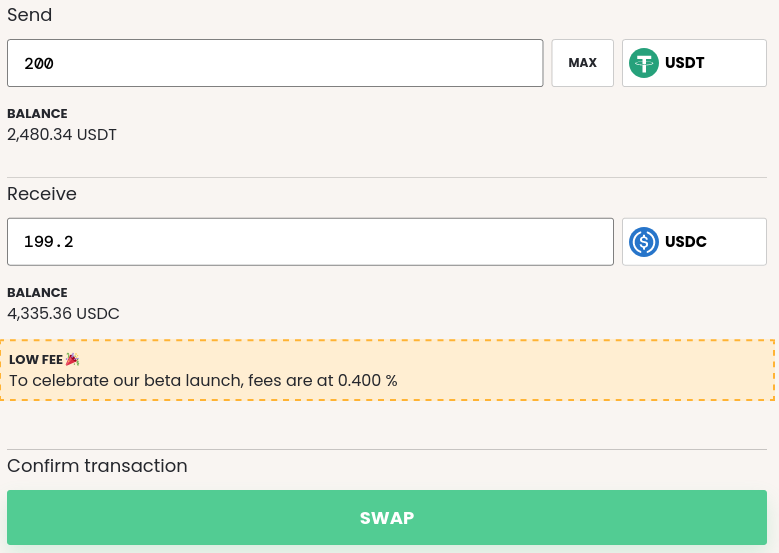
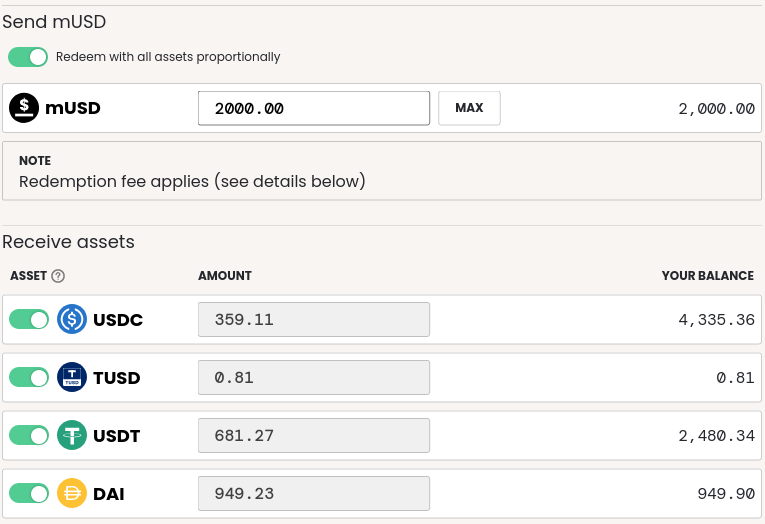

# Introduction

This walkthrough will show you

* The mStable protocol and what it does
* How to get Ropsten ETH so you can transact on Ropsten
* How to use the Aave Faucet to get USDT
* How to interact with the mStable dApp to get to know the protocol

You can read more about mStable in the [Getting Started](../#what-is-mstable) Section 

## Getting Ropsten ETH

mStable is deployed on Ropsten and using Ropsten is recommended for experimenting with the protocol.

It is recommended that you have [MetaMask](https://metamask.io/) setup with some test Ethereum accounts.

You can request Ropsten ETH from the [MetaMask Faucet](https://faucet.metamask.io/). If you are using MetaMask ensure that you have selected the Ropsten network.

After a while you should the transaction will be confirmed and you will see that you have some ETH.

## Getting Test Stablecoins

To interact with mStable you will need one or more of the following Stablecoins.

* USDC
* USDT
* TUSD
* DAI


**Note:** Stablecoins on Ropsten have no value.


The mStable protocol on Ropsten uses the following stablecoins.

* DAI `0xb5e5d0f8c0cba267cd3d7035d6adc8eba7df7cdd`
* USDC `0x8a9447df1fb47209d36204e6d56767a33bf20f9f`
* TUSD `0xb36938c51c4f67e5e1112eb11916ed70a772bd75`
* USDT `0xB404c51BBC10dcBE948077F18a4B8E553D160084`

Test tokens can be obtained from the [Aave Faucet](https://testnet.aave.com/faucet/).

The Tether faucet is known to work so this is recommended. Request some USDT so that you can use the mStable protocol.

## Interacting with the mStable dApp

First let's introduce the mStable protocol using the [mStable dApp ](https://app-dot-mstable-ropsten.appspot.com/)on Ropsten.

After reading this section you will have a good idea of the protocol, how you can use your stablecoins and what you might build on mStable.

### MINT

You can mint mUSD using DAI, USDC, USDT and TUSDT. Using the test USDT that you got from the Aave Faucet let's mint some mUSD.

First approve your USDT for spending and then mint. After minting you'll have the equivalent amount of mUSD.

mUSD is an ERC-20 token and intended to be a composable base layer for DeFi applications.

### SAVE

SAVE offers a native stablecoin interest rate for mUSD. You can earn interest on your mUSD by depositing it into SAVE. The mStable protocol generates yield through swap fees and depositing stablecoins with lending markets.

After minting mUSD, deposit it into SAVE.

### SWAP

SWAP offers a market for stablecoin swaps. Arbitrage traders can profit from stablecoins being slightly under or over peg and this promotes a stablecoin returning to peg. The swap fees from this market also generates yield for SAVE depositors.

### REDEEM

REDEEM allows underlying stablecoins to be redeemed from mUSD. You can choose to redeem in any of the stablecoins in the basket or a mix of all of them.

Now you have a good idea of the protocol and how to use the mStable dApp on Ropsten dive into the [Developers section](developers.md) to understand how you can build applications on top of the protocol using the smart contract interfaces.

