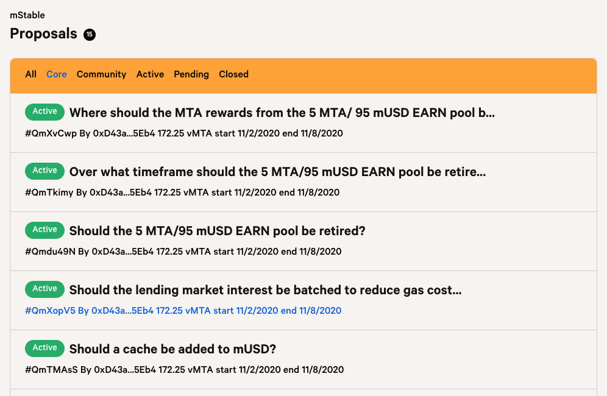

# MTA Staking

## Staking V1

This is the current implementation of MTA staking, and went live at the end of September 2020. Once a Meta holder locks their tokens in the staking contract and begins voting on proposals they become a Governor. Staking V1 has the following key characteristics:

* Longer staking lockups result in higher staking returns \(in MTA\) and voting weights
* Staking MTA does not expose the staker to loss in the event of a bAsset losing its peg
* Stakers will need to manually migrate over to the V2 contract when it goes live

Meta Governors are able to stake their tokens and participate in on chain signalling via snapshot with staked their MTA. Stakers can lock up their tokens for a period of time that ranges from 1 week from lockup to the end of September 2021. By this time, Staking V2 is expected to have been implemented with MTA staking migrated over to the new contracts.

More information about Staking V1 can be found [here](https://medium.com/mstable/mstable-v1-staking-launch-33a0a8f5da27) and [here](https://medium.com/mstable/mta-staking-v1-voting-weights-and-rewards-3a25d1d42124).

## Staking V2


**This feature has not been fully specified and is not yet implemented.** mStable stakeholders may propose this feature to be launched in [Phase 2](../../protocol/versioning.md#phase-2) of the protocol


