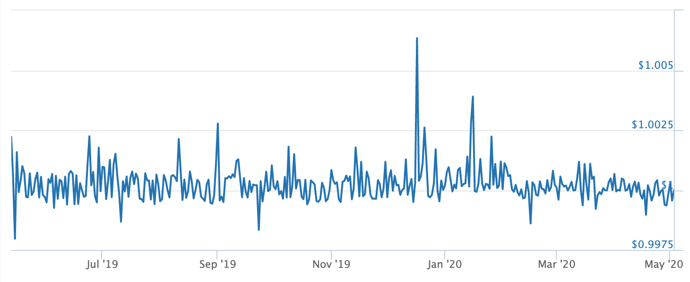

# SWAP

## Zero Slippage Swaps

Unlike other liquidity pool models such as Uniswap and Balancer, mStable employs a **straight line bonding curve** between bAssets, meaning that anyone can trade these underlying stablecoins at a 1:1 ratio. 

These swaps incur no price slippage, and so long as they do not breach weight requirements, can be for any quantity. mStable charges a fixed swap fee in exchange for this. In our mUSD basket, for example, users will be able to swap between these underlying stablecoins. 

* DAI
* USDC
* USDT 
* TUSD
* sUSD

## Upcoming AMM Upgrade

mStable's swap product will soon be upgraded with a new automatic market maker \(AMM\). This upgrade will impact fees, max weights, and minting & redemption rules. More detail on this can be found in the [Upgraded AMM section](../../appendix/roadmap/upgraded-amm.md). This is expected to be implemented by the end of 2020.

## How?

mStable pools stablecoins and tokenized assets of similar value. For example, mUSD will pool USD stablecoins, mBTC will pool tokenized BTC and so on. These tokenized assets are selected by mStable governors and are deemed to have adequate security guarantees against peg loss. This has important implications, one being: any deviation from the peg of an underlying asset is highly likely to be impermanent. 

Take USD stablecoins as an example. Say we allow 4 USD stablecoins in the basket. These stablecoins will constantly move slightly from their $1.00 peg, but over time they are very likely to trade around $1.00. For any given period, each stablecoin's price over time will will look something like this:

So far, 100% of the peg deviations of the major USD stablecoins have been impermanent. Since these losses are impermanent, we can allow our bonding curve to be constant, namely:

_q\(x\)+q\(y\)=k_

 Therefore, the USD stablecoins can be exchanged 1 for 1, a constant bonding curve. The slope is constant, meaning price is independent of supplies of coin x and coin y.

In sum:

* Apart from a trading fee, there is zero slippage trading stablecoins and tokenized assets on mStable. Price remains the same independently of assets in the basket.
* Since assets are interchangeable, mStable allows minting and redemption of any coin instead of the exact basket \(as long as max weights are not breached\).

## Arbitrage

The `swap`function can be used to arbitrage between bAssets when a spread exists. This will occur when:

* When the price differential is greater than the swap fee plus its gas cost. 
* There is excess room in the system between a bAsset and its max weights to allow mStable to take on more of that undervalued asset.

This persistent arbitrage implies that the price of the mAsset will track the value of the lowest price underlying assets at their maximum weights. We do not judge this to be an issue, as we believe **impermanent losses** between stablecoins are an inherent and normal part of the DeFi ecosystem. In fact, it is a core pillar of mStable [SAVE](native-interest-rate.md) product, which is in part built to compensate mUSD holders for their exposure to this impermanent loss. 

mStable should positively contribute to the efficiency of stablecoin markets, whilst simultaneously allowing arbitrageurs and the platform to profit from normal and safe oscillations in stablecoin prices.

## Maximum Weights

Allowing users to swap bAssets at 1:1 introduces risks into the system that must be managed.  As a result of this, the system has been built so that no individual bAsset can exceed a maximum weight for any given bAsset \(35%, of total, for example\). If an underlying bAsset has hit its maximum weight, the rules governing the system change, so that minting, redemption and swap rules are altered. 

### Swaps at maximum weight

Swaps that would push a bAsset above its max weight are not allowed. Swaps that do not affect the bAsset at maximum weight are unaffected.

### Minting and Redemption at maximum weight

Minting and redemption activity that would push a bAsset above its max weight are not allowed. Importantly, those wishing to redeem mAssets at these times must redeem the basket at its underlying weights; this is presented as "multi redemption". Read more in the [Forging](minting-and-redemption/) section.

### Swap Fees

Swap fees are a flat fee, charged in the asset received by a user. These fees will be set by Governors. 

